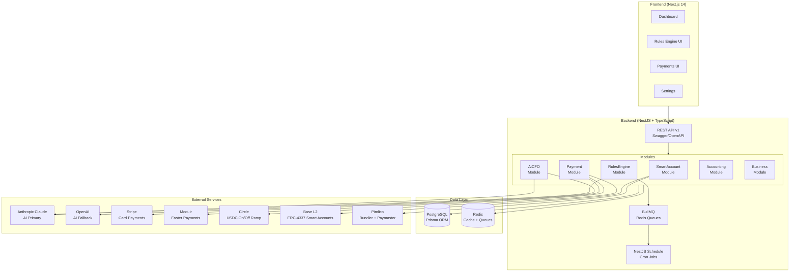

# AI CFO Wallet

**Programmable treasury and payment layer for modern SMEs**

Prepared by Buypath Ltd — February 2026

---

## Architecture Overview



## Project Structure

```
ai-cfo-wallet/
├── backend/                          # NestJS TypeScript backend
│   ├── prisma/
│   │   ├── schema.prisma             # Data model (8 core entities)
│   │   └── seed.ts                   # Test business seed data
│   ├── src/
│   │   ├── app.module.ts             # Root module
│   │   ├── main.ts                   # Entry point + Swagger setup
│   │   ├── common/
│   │   │   ├── prisma/               # PrismaService (global)
│   │   │   ├── exceptions/           # Custom exception classes
│   │   │   └── filters/              # Global HTTP exception filter
│   │   └── modules/
│   │       ├── smart-account/        # Phase 2: ERC-4337 smart accounts
│   │       │   ├── smart-account.service.ts
│   │       │   ├── paymaster.service.ts
│   │       │   └── sub-wallet.service.ts
│   │       ├── rules-engine/         # Phase 3: NL rules + BullMQ executor
│   │       │   ├── rule-parser.service.ts     # Claude NL → JSON
│   │       │   ├── rule-validator.service.ts
│   │       │   ├── rule-executor.service.ts   # BullMQ processor
│   │       │   ├── rule-scheduler.service.ts  # Cron + threshold monitor
│   │       │   └── prompts/
│   │       ├── payment/              # Phase 4: Multi-rail orchestration
│   │       │   ├── stripe.service.ts
│   │       │   ├── modulr.service.ts
│   │       │   ├── circle.service.ts
│   │       │   ├── batch-payout.service.ts
│   │       │   └── payment-orchestrator.service.ts
│   │       ├── ai-cfo/               # Phase 5: AI intelligence layer
│   │       │   ├── ai-provider.service.ts     # Claude + OpenAI wrapper
│   │       │   ├── cashflow-forecast.service.ts
│   │       │   ├── tax-estimator.service.ts
│   │       │   ├── treasury-advisor.service.ts
│   │       │   ├── anomaly-detector.service.ts
│   │       │   └── prompts/
│   │       ├── accounting/           # Phase 6: CSV exports + categorisation
│   │       │   ├── transaction-categorizer.service.ts
│   │       │   ├── xero-csv-export.service.ts
│   │       │   └── quickbooks-csv-export.service.ts
│   │       ├── auth/                 # JWT auth module
│   │       └── business/             # Business profile + KYC
│   ├── .env.example                  # All required environment variables
│   ├── Dockerfile
│   ├── package.json
│   └── tsconfig.json
├── frontend/                         # Next.js 14 App Router frontend
│   └── src/
│       ├── app/
│       │   ├── layout.tsx            # Root layout with Sidebar
│       │   ├── page.tsx              # Redirect to /dashboard
│       │   ├── dashboard/page.tsx    # Balance cards, forecast chart, insights
│       │   ├── rules/page.tsx        # Rules CRUD + templates
│       │   ├── payments/page.tsx     # Scheduled, history, batch upload
│       │   └── settings/page.tsx     # Team, integrations, security, notifications
│       ├── components/
│       │   ├── layout/Sidebar.tsx
│       │   ├── dashboard/            # BalanceCards, ActiveRules, etc.
│       │   └── charts/CashflowChart.tsx
│       └── lib/api.ts                # Typed fetch client
└── docker-compose.yml                # PostgreSQL + Redis
```

## Quick Start

### Prerequisites

- Node.js 20+
- Docker & Docker Compose
- Anthropic API key (and optionally OpenAI for fallback)

### 1. Start infrastructure

```bash
docker-compose up -d postgres redis
```

### 2. Backend setup

```bash
cd backend
cp .env.example .env
# Edit .env with your API keys

npm install
npm run prisma:migrate
npm run prisma:seed
npm run start:dev
```

API available at: `http://localhost:3000`
Swagger docs: `http://localhost:3000/api/docs`

### 3. Frontend setup

```bash
cd frontend
npm install
npm run dev
```

Frontend available at: `http://localhost:3001`

---

## API Reference

All endpoints are versioned under `/api/v1/`.

| Module | Endpoint | Description |
|---|---|---|
| Business | `GET /business/:id/wallets` | List all wallets |
| Rules | `POST /rules/parse` | Preview rule parsing (no save) |
| Rules | `POST /rules` | Create rule from natural language |
| Rules | `GET /rules/templates` | List 10 pre-built templates |
| Rules | `PATCH /rules/:id/activate` | Activate a rule |
| Payments | `POST /payments` | Create a payment (auto-routes rail) |
| Payments | `POST /payments/batch` | Process batch payouts |
| Smart Accounts | `POST /smart-accounts/create` | Create ERC-4337 account |
| Smart Accounts | `POST /smart-accounts/simulate` | Dry-run a transaction |
| AI CFO | `GET /ai-cfo/forecast/cashflow` | 90-day cashflow forecast |
| AI CFO | `GET /ai-cfo/tax/estimate` | UK tax liability estimates |
| AI CFO | `GET /ai-cfo/treasury/analysis` | Treasury recommendations |
| AI CFO | `GET /ai-cfo/anomalies` | Recent anomaly detections |
| Accounting | `POST /accounting/categorise` | AI-categorise transactions |
| Accounting | `GET /accounting/export/xero` | Xero CSV download |
| Accounting | `GET /accounting/export/quickbooks` | QuickBooks CSV download |

Full interactive docs at `/api/docs` (Swagger UI).

---

## Rules Engine

The rules engine converts plain English into executable treasury automation:

```
"Keep 3 months operating expenses in GBP — convert any excess to USDC"
```

Parsed by Claude into:

```json
{
  "trigger": "threshold",
  "condition": {
    "type": "balance_exceeds",
    "wallet": "gbp_primary",
    "threshold": "calculated_3mo_opex",
    "checkInterval": "daily"
  },
  "action": {
    "type": "convert_excess",
    "from_currency": "GBP",
    "to_currency": "USDC",
    "destination": "usdc_treasury"
  }
}
```

### Pre-built templates

1. Weekly VAT Allocation
2. Monthly Pension Contribution
3. Supplier Auto-Pay (7 days early)
4. FX Conversion Threshold
5. Low Balance Alert
6. Monthly Payroll (mixed fiat + USDC)
7. Monthly Surplus Sweep
8. OpEx Reserve Top-Up
9. Quarterly Profit Distribution
10. Emergency Fund Top-Up

---

## Environment Variables

See `.env.example` for full documentation. Key variables:

| Variable | Description |
|---|---|
| `ANTHROPIC_API_KEY` | Claude API key (primary AI provider) |
| `OPENAI_API_KEY` | OpenAI API key (fallback) |
| `PIMLICO_API_KEY` | ERC-4337 bundler + paymaster |
| `STRIPE_SECRET_KEY` | Card payments |
| `MODULR_API_KEY` | UK Faster Payments |
| `CIRCLE_API_KEY` | USDC on/off ramp |
| `DATABASE_URL` | PostgreSQL connection string |
| `REDIS_HOST` | Redis host for queues + cache |

---

## Licence

MIT — Buypath Ltd, 2026
